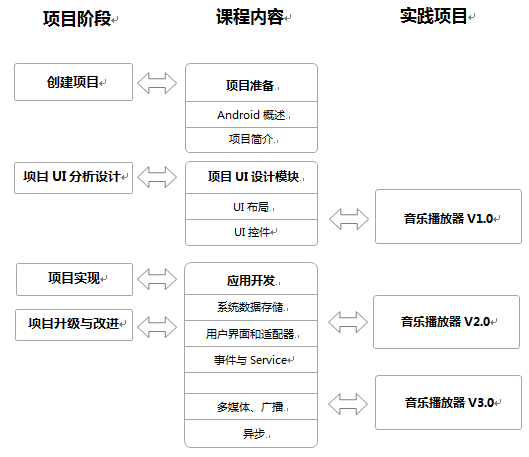

# Android开发入门

## 课程介绍

本课程定位为面向学生科研创新训练的课程，旨在培养学员移动互联网+时代手机应用App开发的基本能力。通过课程的学习，使学员了解并掌握Android开发环境的安装和部署过程，Android项目的架构及应用程序组成，手机用户界面的布局方法和常见开发控件的使用，Android中的文件存储管理、多媒体应用开发、Anroid项目发布等知识。课程突破传统讲授方法，将知识点融入Android平台下MP3音乐播放器App的实现过程中。

小伙伴们，还在等什么？快点一起跟我们来做MP3音乐播放器吧  ^_^！

##培养目标

## 课程特色
课程需要根据课程知识点需求设计一个具体的教学示例“音乐播放器”，将项目分为3个迭代版本，以项目开发准备、项目UI分析设计、项目实现及升级改造螺旋式推进知识点的学习。

